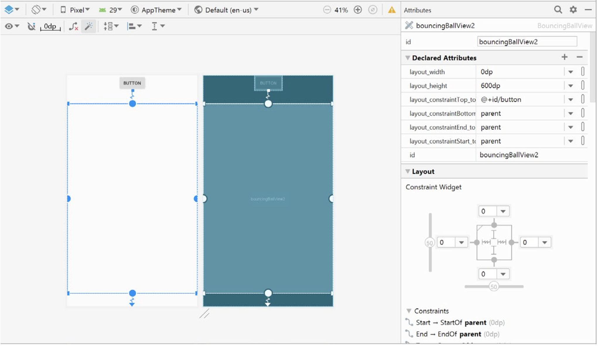

# CSE311 Mobile Computing Coursework Details

This coursework is based on the lab task of Lecture 13.

## Your task:

In this coursework, you are asked to create an app with a single activity. This activity contains a button (labelled as "add") at the top and a customised View below it.
- When your app starts, there should be a blue bouncing ball in the customised View.
- Every time you click the "Add" button, a new blue bouncing ball will appear.
- How the ball bounces is up to you.
- The bouncing balls can overlap, but if they always overlap with each other and I cannot
differentiate them easily, you'll get reduced marks.
- The maximum number of bouncing balls is 3.
- Whenever you touch a bouncing ball (that is, the point of touch is within the circle of the ball),
the ball should change its colour to red.
- When the ball leaves the point(s) of touch, it should change back to its original colour: blue.
- This app should support multi-touch. But unlike the Lab 13, you don’t need to draw anything
extra on the screen when you touch the screen. Extra note:
- The bouncing ball should animate correctly even when your fingers are not touching the screen.
- To make my marking process easier, please draw these balls big enough but not too big.
- You will get around 65 if only single touch is supported and your app functions correctly.
- You can get full mark when everything has been implemented and there is no outstanding
issues.
- You may choose **any** layout for your activity. Below is an example.

