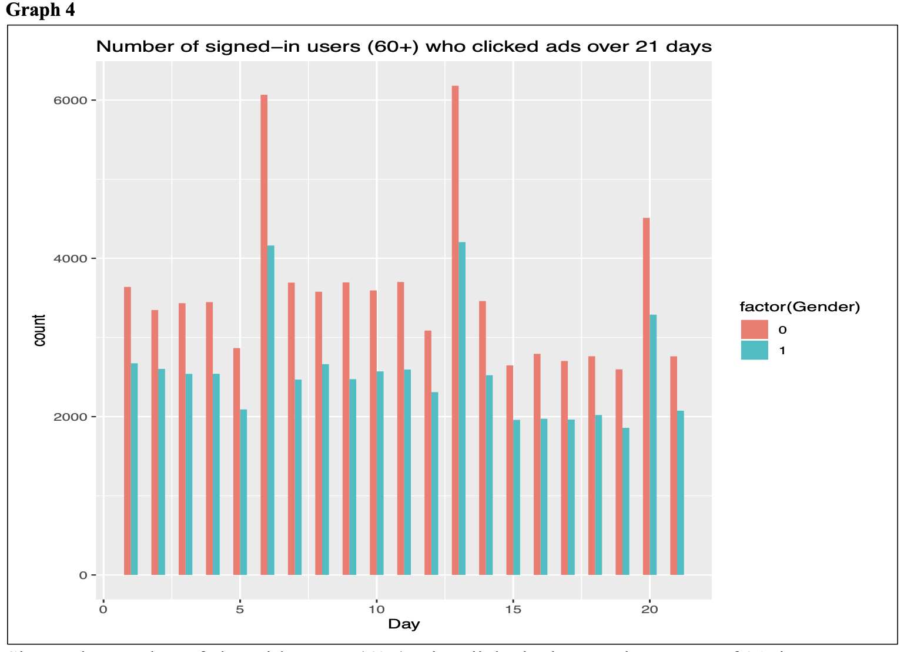

# CSE313 Big Data Analytics Assessment 1

## I. Findings (20 Marks)
The six steps of the Big Data Analytics process were used as a guideline for the completion of this assignment.
1. Data Acquisition: In the first step, the Doing Data Science (DDS) dataset consisting of 31 CSV files was read into the program using the read.csv function from the R standard library utils package. Since the data type for each column was read in as integer by default, colClasses=“integer” was specified as a parameter, which drastically improved data import time. Approximate time to read in the sample size of 21 CSV files decreased from 20.96 seconds to 14.03 seconds.
2. Data Exploration: After importing the data, it was explored by: checking the data frame’s header for column names and datatypes, getting information about the number of records of the entire dataset and some of its subsets, and viewing a summary of the dataset. A correlation between the ‘Signed_In’ value and ‘Age’ and ‘Gender’ attributes was discovered in this step.
3. Pre-processing: Based on the findings in the previous step, a subset containing only records where Signed_In is true was created.
4. Analysis: Transformed dataset was examined and visual representations were plotted.
5. Evaluation: See graphs in part III.
6. Knowledge

## II. Source Code (50 Marks)

## III. Plots Produced (30 Points)

Shows the total number of clicks made by signed-in users over the course of 21 days. Trend: Spike in clicks approx. every 7 days implies more site traffic on weekends.

Shows the number of signed-in users (by gender) who clicked ads.
Trend: Male/Female clicks similar overall; spike in clicks approx. every 7 days as above.

Shows the number of signed-in users (by age group) who clicked ads.
Trend: Users (min. age) 3-29 and 60+ are largest site demographic; weekly click spike.

Shows the number of signed-in users (60+) who clicked ads over the course of 21 days.
Trend: Same weekly click spike but significantly higher number of clicks by gender in this age demographic when compared to overall.

Represents the click-through-rate (CTR=#Clicks/Impressions) of ads over the course of 21 days categorized by age group.

Demonstrates total number of clicks from both signed-in and not signed-in users.
Clear representation of the weekly spike in user ad clicks implying increased site traffic on weekends.