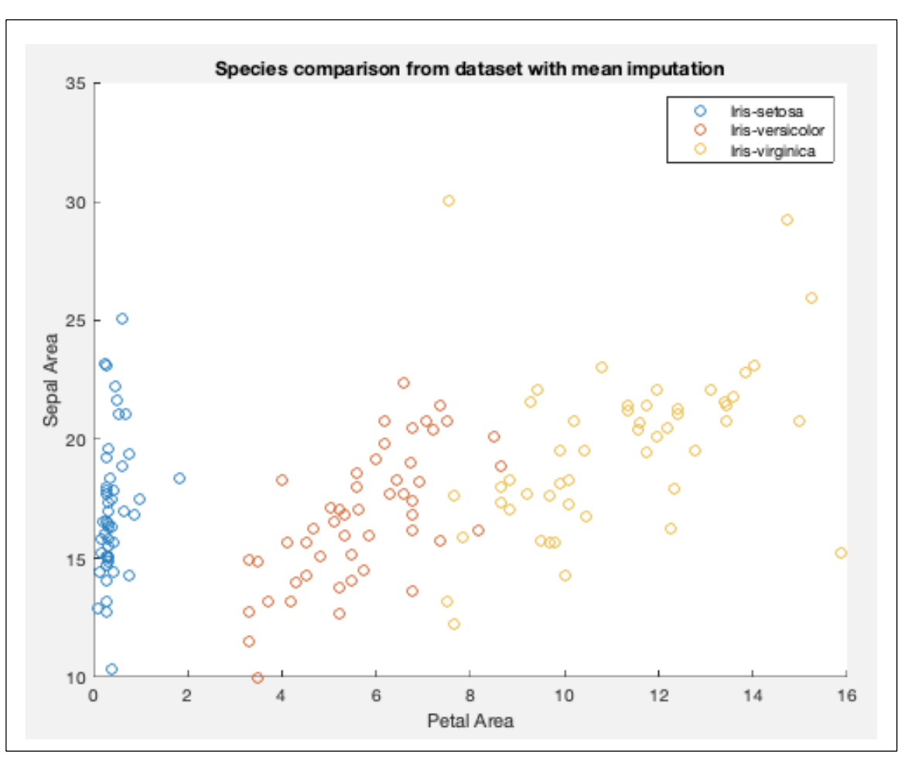

# CSE315 Machine Learning Assignment 1

## Task 1 Data Pre-processing [30 Marks]

### 1. Import the dataset irismissing.csv into a data frame and find the row number of each instance that has missing values. [10 marks]

**Excerpt from task1.m console output:**

```
Loading Data ...

  Name        Size            Bytes  Class    Attributes
  T         150x6             29070  table

Number of samples: 150
Number of features: 6

Number of rows with missing values: 18

Id 4 11 20 28 32 33 47 58 63 83 91 97 102 119 129 132 138 145

Task 1.1 "Load data" complete. Press any key to continue.
```

### 2. Write a program to drop missing values, and describe other two strategies (median, mean) for handling missing values and write a function to implement these strategies. [10 marks]

Imputation using the mean/median values of features, i.e. table columns, can be used as a possible strategy for handling missing values. This strategy works well with small numerical datasets; however, it does not take possible relationships between features into account and should not be used on categorical features. The more computationally expensive *k-nearest neighbors* (kNN) algorithm can be used for increased accuracy on continuous, discrete, ordinal, and categorical data.

**Excerpt from task1.m console output:**

```
Rows containing NaN successfully removed.
Number of rows with missing values in transformed table: 0

Handling missing values with mean imputation:
mean(SepalLengthCm) for rows [20, 119, 138] = 5.8462
mean(SepalWidthCm) for rows [11, 28, 33, 47, 58, 63, 102, 129] = 3.0424
mean(PetalLengthCm) for rows [4, 83, 91, 132, 145] = 3.7742
mean(PetalWidthCm) for rows [32, 97] = 1.2114

Handling missing values with median imputation:
median(SepalLengthCm) for rows [20, 119, 138] = 5.8
median (SepalWidthCm) for rows [11, 28, 33, 47, 58, 63, 102, 129] = 3
median (PetalLengthCm) for rows [4, 83, 91, 132, 145] = 4.4
median (PetalWidthCm) for rows [32, 97] = 1.35

Task 1.2 "Imputation" complete. Press any key to continue.
```

### 3. Compare the results of applying each missing value strategy using some visualization method. [10 marks]

For each of the flower species of the irismissing dataset, i.e., {“Iris-setosa, “Iris-versicolor”, “Iris-viginica”}, the sepal area (SepalLengthCm * SepalWidthCm) and the petal area (PetalLengthCm * PetalWidthCm) are visualized below as scatter plots.

The following scatter plot represents the *irismissing* dataset with missing values removed:


The following scatter plot represents the *irismissing* dataset using mean imputation to handle missing values:



Comparison of the resulting visualized data shows that imputing missing values using a global mean for each feature produced outliers, as highlighted in the following figure:


The use of median imputation produced similar results as depicted above.

**Excerpt from task1.m console output:**

```Task 1.3 "Visualization" complete. End of Task 1.```


## Task 2 Decision Trees [30 Marks]

### 1. Manually generate the decision tree for the passenger survival dataset. Use information gain as the split measure. [20 marks]

Calculations for determining information gain were done by hand to manually induce the decision tree.

In order to determine the tree root, first the entropy of the set was calculated by taking the sum of the frequency of each row where “Survived=Yes” (548) and where “Survived=No” (817):


 

### 2. In the figure you can find the Tennis data from the example we used in Lecture 3 on describing the ID3 algorithm.

#### 2.2.1 Write a function that computes the entropy of a set S with Npos positive observations and Nneg negative observations. [10 marks]

**Excerpt from task2.m console output:**

```
Positive observations: 9
Negative observations: 5
Entropy of set: 0.940286

Task 2.2.1 "Entropy function" complete. Press any key to continue.
```

#### 2.2.2 Write a function that takes input as a set S of observations and an attribute A from these observations, and calculates the information gain denoted as Gain(S,A), as if we were to split on that attribute in the context of the ID3 decision tree algorithm. [10 marks]

Created functions “meanImputation.m” and “medianImputation.m” which are called in this section of the program with output used in the following section “Task 2.2.3”.

**Excerpt from task2.m console output:**

```Task 2.2.2 "Information Gain function" complete. Press any key to continue.```

#### 2.2.3 Estimate the information gain of all the attributes. Which one will you choose for the root node of your decision tree? [10 marks]

**Excerpt from task2.m console output:**

```
'Outlook'        [0.2467]
'Temperature'    [0.0292]
'Humidity'       [0.1518]
'Wind'           [0.0481]

Root node selection (max. information gain): Outlook

Task 2.2.3 "Root Node selection" complete. End of Task 2.
```


## Task 3 Decision Tree Algorithm [20 Marks]

### 1. Implement the ID3 decision tree from the pseudocode (recursive algorithm) below and induce/learn the tree from the data in the figure of Task 2.2 (see above).

The concrete implementation of the ID3 algorithm based on the pseudocode can be found in function “ID3.m” and is called from the script “task3.m”.

**Excerpt from task3.m console output:**

```
Importing comma-separated values ...
Found attributes: 'Outlook' 'Temperature'
'Humidity'
[0.2467]
'Wind'
Begin ID3 algorithm ...
Observations
<table output redacted for space>
Node selection (highest info gain):
Branches of Outlook:
'Sunny'
'Overcast'
'Rain'
Branch "Sunny":
Observations
<table output redacted for space>
'Outlook'
Outlook-->Sunny is not a leaf node.
Node will be split and a new decision node will be created below it.
Begin ID3 algorithm ...
Observations
<table output redacted for space>
Node selection (highest info gain):
Branches of Humidity:
'High'
'Normal'
'Humidity'
[0.9710]
Branch "High":

Observations
<table output redacted for space>
Humidity-->High is a leaf node: Entropy(PlayTennis:"No") = 0.
Branch "Normal":
Observations
<table output redacted for space>
Humidity-->Normal is a leaf node: Entropy(PlayTennis:"Yes") = 0.
Branch "Overcast":
Observations
<table output redacted for space>
Outlook-->Overcast is a leaf node: Entropy(PlayTennis:"Yes") = 0.
Branch "Rain":
Observations
<table output redacted for space>
Outlook-->Rain is not a leaf node.
Node will be split and a new decision node will be created below it.
Begin ID3 algorithm ...
Observations
<table output redacted for space>
Node selection (highest info gain):
Branches of Wind:
'Weak'
'Strong'
Branch "Weak":
'Wind'    [0.9710]

   Observations
   <table output redacted for space>
Wind-->Weak is a leaf node: Entropy(PlayTennis:"Yes") = 0.
   Branch "Strong":
   Observations
   <table output redacted for space>
Wind-->Strong is a leaf node: Entropy(PlayTennis:"No") = 0.
Task 3 "Decision Tree Algorithm" complete. End of Task 3.
The following decision tree for the ‘playtennis.csv’ dataset can be induced from the implementation: