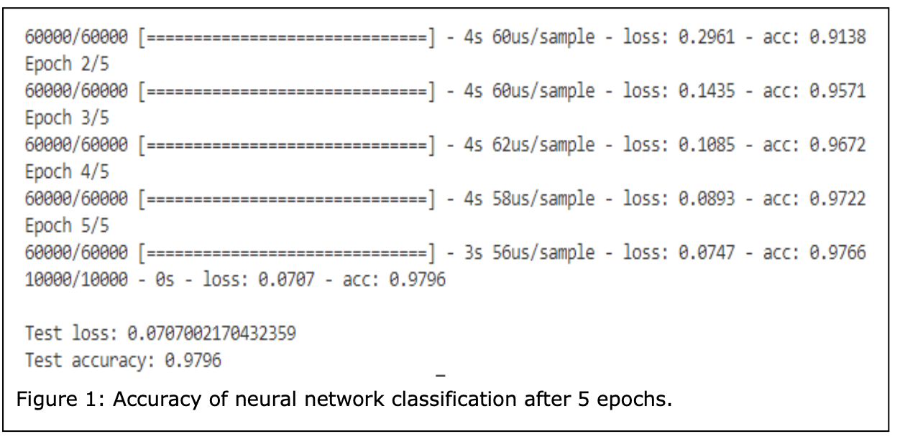
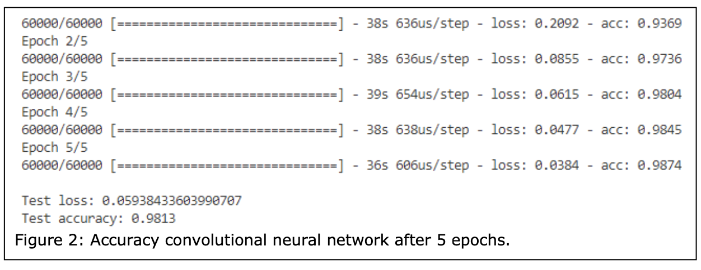
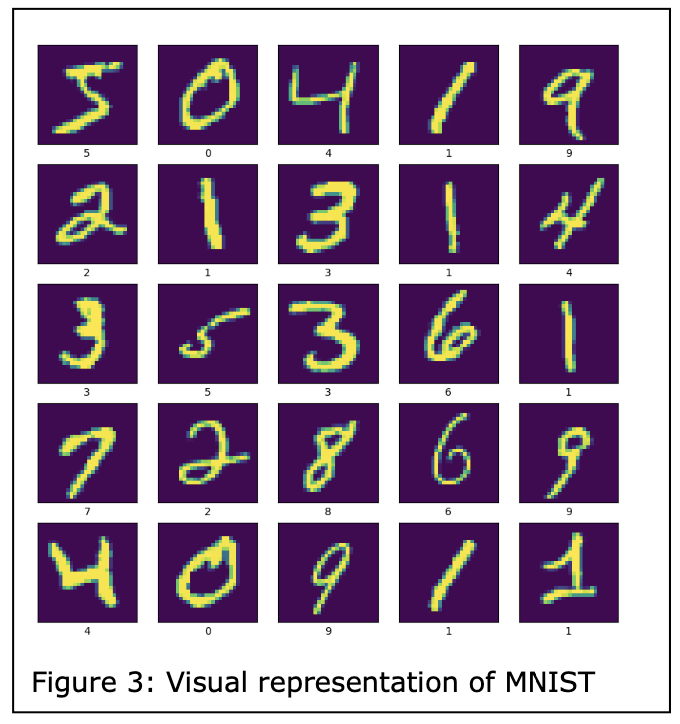
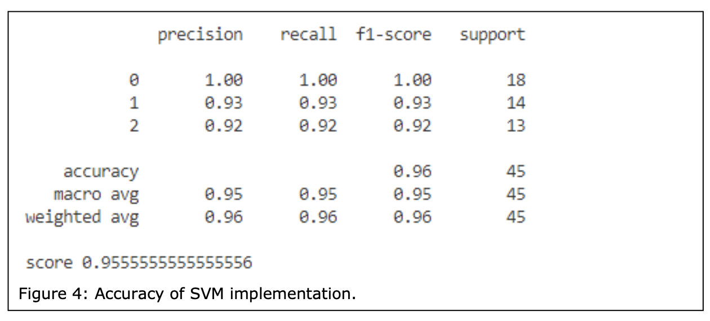
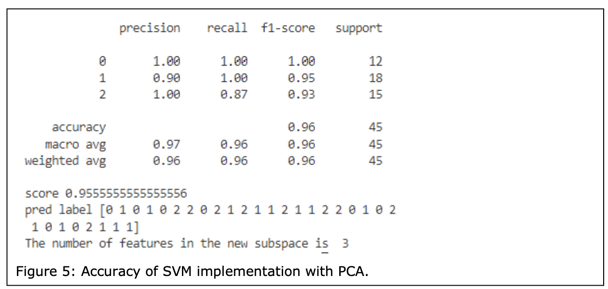
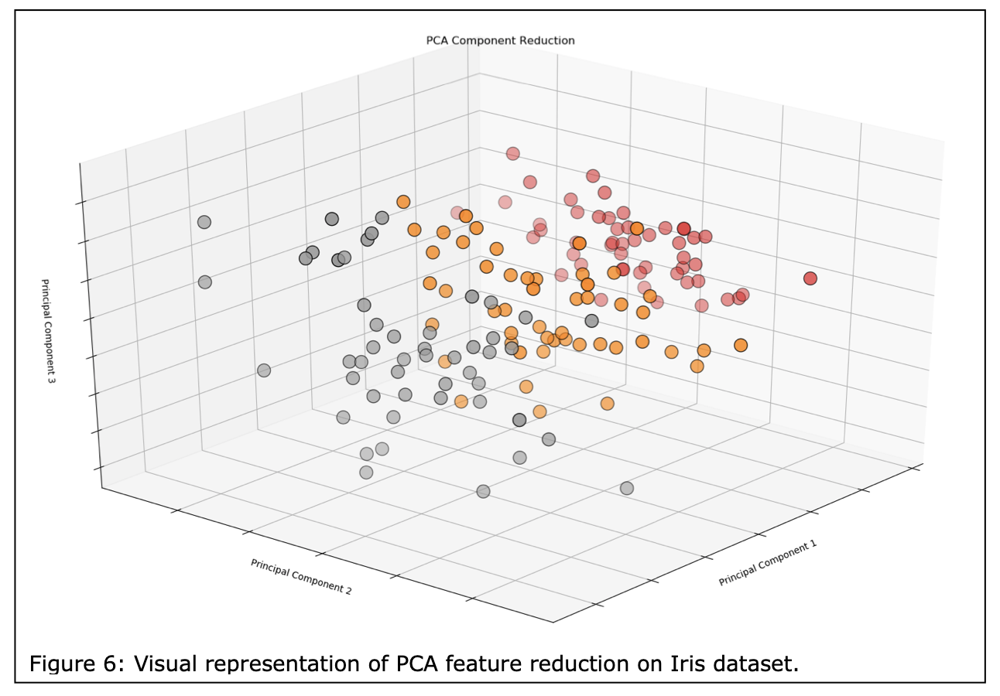

# CSE315 Machine Learning Assignment 2

## Task 1 Classification [35 Marks]

### 1. Using the MNIST database available at http://yann.lecun.com/exdb/mnist/, select two classification algorithms and implement them to achieve a high accuracy (more than 90%). [15 marks]

Selected classification algorithms:

1. **Neural Network (NN)** classification written in Python utilizing Tensorflow with Keras library: keras.layers.Dense

2. **Convolutional Neural Network (CNN)** classification written in Python utilizing Tensorflow with Keras library: keras.layers.Conv2D

### 2. Describe the techniques, including data preparation, feature reduction, and training tricks in your classification algorithms. [10 marks]

**Data import and exploration**

- Imported MNIST dataset from keras.datasets and loaded using loaddata() function.
- (x_train_img, y_train_lbl) is the training set data the models (i.e. NN, CNN) use to learn; consists of 60,000 training examples.
- (x_test_img, y_test_lbl) is the test data used by the models to test against the training data; consists of 10,000 test examples.
- Image examples contain grayscale RGB code values (min. 0 to max. 255).
- Label examples contain corresponding labels (from 0 to 9).
- The training set shape is used to explore the format of the dataset before training the
model. Prints the number of training images and their size in pixels, i.e. (60000, 28, 28).
- A 10 x 10 matrix of training images and their corresponding labels are displayed using
matplotlib.pyplot to help visualize the training data.

**Data preparation / normalization (preprocessing)**

- Data must be preprocessed before training the network since data quality and information derived therefrom directly influence a model’s ability to learn.
- Training and test set data must be standardized/preprocessed in the same way, e.g. the number of features and what they represent should be the same. Otherwise the predictive model will not make sense.
- Training and test data are divided by 255.0 (i.e. the maximum possible RGB value) to convert integer values to floating-point values. Affords computational convenience by allowing each datapoint in the range of 0-255 to be described within a 0.0 to 1.0 range, where 0.0 = 0 (0x00) and 1.0 = 255 (0xFF).
- CNN model: Keras Conv2D library expects input in 4 dimensions, including automatically added “batch” dimension. Therefore, input shape changed to (28, 28, 1).

**Feature reduction and training tricks / compiling and fitting the models**

- Adjusting dropout value can help reduce the risk of overfitting.

### 3. Analyze some other techniques that can be applied in your classification algorithms to improve your model’s performance such as accuracy, efficiency, and storage. [10 marks]

- Adjusting the number of epoch interactions over the dataset from 5 to 50 for the neural network greatly increased training time but resulted in similar accuracy, i.e. 0.9796 with five epochs --> 0.9805 with 50 epochs.
-  PCA could be applied to reduce the dimensionality down from 28 * 28 = 784 dimensions, reducing the amount of time it takes to fit the machine learning algorithm.

## Task 2 Support vector machine (SVM) and principal component analysis (PCA) [40 Marks]

### 1. Using the iris.data available on the ICE, select the training dataset and validation dataset, and implement the SVM algorithm (based on public packages or libraries) to classify the types of iris (achieving an accuracy of 90%). [10 marks]

- Results of implementation using Scikit Learn library: sklearn.svm.SVC

### 2. Using the same iris.data, reduce the dimension of features applying the PCA and extract the first, second, and third principal components. [10 marks]

- Results of implementation using Scikit Learn libraries: sklearn.svm.SVC and sklearn.decomposition.PCA

### 3. Using the extracted first, second, and third principal component in Task 2.2, respectively, to train an SVM model to classify the types of iris and compare their accuracies. [10 marks]

Training with individual principal components delivered the following results:

| PC1  | PC2 | PC3 |
| ------------- | ------------- | ------------- |
| 0.9111111111111111 | 0.35555555555555557 | 0.5333333333333333 |

